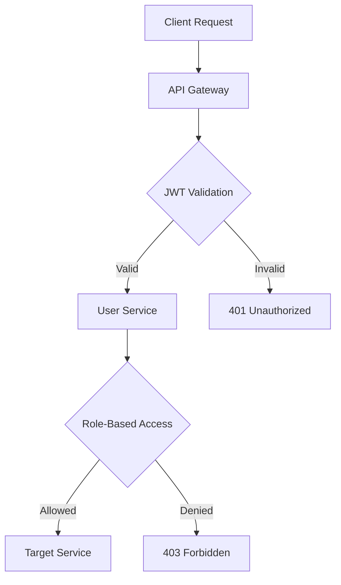
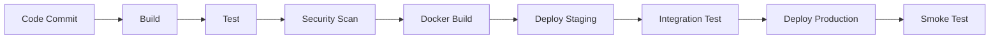

# NEXUS Platform Architecture Overview

## System Architecture

NEXUS is a comprehensive financial management platform built with a modern, scalable microservices architecture. The platform provides secure, real-time financial tracking, analytics, and management tools for individuals and businesses.

## Core Principles

### 1. Microservices Architecture

- **Service Decomposition**: The platform is divided into focused, independently deployable services
- **Domain-Driven Design**: Each service owns its domain logic and data
- **API Gateway**: Centralized entry point for all client requests
- **Service Discovery**: Automatic service registration and discovery

### 2. Security First

- **Zero Trust Architecture**: Every request is authenticated and authorized
- **End-to-End Encryption**: Data encrypted in transit and at rest
- **Multi-Factor Authentication**: Enhanced security for user accounts
- **Audit Logging**: Comprehensive logging of all security events

### 3. Observability

- **Distributed Tracing**: End-to-end request tracing across services
- **Metrics Collection**: Real-time performance and business metrics
- **Centralized Logging**: ELK stack for log aggregation and analysis
- **Health Monitoring**: Automated health checks and alerting

### 4. Scalability & Performance

- **Horizontal Scaling**: Services can scale independently
- **Caching Strategy**: Multi-level caching (Redis, CDN, browser)
- **Database Optimization**: Read/write splitting and indexing
- **Async Processing**: Background job processing for heavy operations

## Service Architecture

### Core Services

#### 1. API Gateway (`api-gateway`)

- **Purpose**: Centralized entry point for all client requests
- **Technologies**: FastAPI, Redis
- **Responsibilities**:
  - Request routing and load balancing
  - Authentication and authorization
  - Rate limiting and throttling
  - Request/response transformation
  - API versioning

#### 2. User Service (`user-service`)

- **Purpose**: User management and authentication
- **Technologies**: Python, FastAPI, PostgreSQL, Redis
- **Responsibilities**:
  - User registration and profile management
  - JWT token generation and validation
  - Multi-factor authentication
  - User preferences and settings
  - Session management

#### 3. Transaction Service (`transaction-service`)

- **Purpose**: Financial transaction processing
- **Technologies**: Python, FastAPI, PostgreSQL, Redis
- **Responsibilities**:
  - Transaction creation and validation
  - Category management
  - Multi-currency support
  - Transaction search and filtering
  - Real-time balance calculations

#### 4. Analytics Service (`analytics-service`)

- **Purpose**: Financial analytics and reporting
- **Technologies**: Python, FastAPI, PostgreSQL, Redis, TensorFlow
- **Responsibilities**:
  - Financial insights and trends
  - Budget vs actual analysis
  - Predictive analytics
  - Custom reporting
  - Data export functionality

#### 5. Notification Service (`notification-service`)

- **Purpose**: Real-time notifications and alerts
- **Technologies**: Python, FastAPI, Redis, WebSocket
- **Responsibilities**:
  - Email notifications
  - Push notifications
  - In-app notifications
  - SMS alerts
  - Notification preferences

### Supporting Services

#### 6. Audit Service (`audit-service`)

- **Purpose**: Security auditing and compliance
- **Technologies**: Python, FastAPI, PostgreSQL, Elasticsearch
- **Responsibilities**:
  - Audit log collection
  - Compliance reporting
  - Security event monitoring
  - Data retention policies

#### 7. Backup Service (`backup-service`)

- **Purpose**: Data backup and recovery
- **Technologies**: Python, PostgreSQL, AWS S3
- **Responsibilities**:
  - Automated database backups
  - File system backups
  - Backup verification
  - Point-in-time recovery

### Infrastructure Services

#### 8. Monitoring Stack

- **Prometheus**: Metrics collection and alerting
- **Grafana**: Dashboard visualization
- **ELK Stack**: Log aggregation and analysis
- **APM**: Application performance monitoring

#### 9. Message Queue

- **Redis**: Caching and session storage
- **RabbitMQ**: Asynchronous message processing
- **Kafka**: Event streaming (future)

## Data Architecture

### Database Design

#### Primary Database (PostgreSQL)

```sql
-- Core tables structure
nexus_platform/
├── users/
│   ├── profiles
│   ├── preferences
│   ├── sessions
│   └── mfa_settings
├── transactions/
│   ├── records
│   ├── categories
│   ├── tags
│   └── attachments
├── budgets/
│   ├── plans
│   ├── categories
│   └── tracking
├── analytics/
│   ├── reports
│   ├── insights
│   └── predictions
└── audit/
    ├── events
    ├── logs
    └── compliance
```

#### Database Patterns

- **Read/Write Splitting**: Separate read and write connections
- **Sharding**: Horizontal partitioning for large datasets
- **Indexing Strategy**: Optimized indexes for common queries
- **Connection Pooling**: Efficient database connection management

### Caching Strategy

#### Multi-Level Caching

1. **Browser Cache**: Static assets and API responses
2. **CDN Cache**: Global content delivery
3. **Application Cache**: Redis for session and computed data
4. **Database Cache**: Query result caching

#### Cache Keys Pattern

```
nexus:{service}:{entity}:{id}:{version}
nexus:user:profile:123:v1
nexus:transaction:list:user_123:2024-01
nexus:analytics:dashboard:user_123:monthly
```

## Communication Patterns

### Synchronous Communication

- **REST APIs**: Standard CRUD operations
- **GraphQL**: Complex queries and mutations
- **gRPC**: High-performance service communication

### Asynchronous Communication

- **Message Queues**: Background job processing
- **Event Streaming**: Real-time data updates
- **WebSockets**: Real-time notifications

### Service Mesh

- **Service Discovery**: Consul/Eureka for service registration
- **Load Balancing**: Intelligent routing and failover
- **Circuit Breakers**: Fault tolerance and resilience
- **Distributed Tracing**: Request tracing across services

## Security Architecture

### Authentication & Authorization



### Data Protection

- **Encryption at Rest**: AES-256 encryption for sensitive data
- **Encryption in Transit**: TLS 1.3 for all communications
- **Key Management**: AWS KMS for encryption key management
- **Data Masking**: Sensitive data masking in logs

### Network Security

- **VPC Isolation**: Services isolated in private networks
- **Security Groups**: Fine-grained network access control
- **WAF**: Web Application Firewall protection
- **DDoS Protection**: Cloud-based DDoS mitigation

## Deployment Architecture

### Container Orchestration

```yaml
# Kubernetes deployment structure
apiVersion: apps/v1
kind: Deployment
metadata:
  name: nexus-user-service
spec:
  replicas: 3
  selector:
    matchLabels:
      app: user-service
  template:
    metadata:
      labels:
        app: user-service
    spec:
      containers:
        - name: user-service
          image: nexusplatform/user-service:latest
          ports:
            - containerPort: 8000
          env:
            - name: DATABASE_URL
              valueFrom:
                secretKeyRef:
                  name: nexus-secrets
                  key: database-url
          resources:
            requests:
              memory: "256Mi"
              cpu: "250m"
            limits:
              memory: "512Mi"
              cpu: "500m"
```

### CI/CD Pipeline



### Environment Strategy

- **Development**: Local development environment
- **Staging**: Pre-production testing environment
- **Production**: Live production environment
- **DR**: Disaster recovery environment

## Monitoring & Observability

### Metrics Collection

```python
# Key metrics tracked
metrics = {
    'http_requests_total': Counter('Total HTTP requests'),
    'http_request_duration_seconds': Histogram('Request duration'),
    'database_query_duration_seconds': Histogram('DB query duration'),
    'cache_hit_ratio': Gauge('Cache hit ratio'),
    'active_users': Gauge('Active user sessions'),
    'error_rate': Counter('Error rate by service'),
    'cpu_usage_percent': Gauge('CPU usage percentage'),
    'memory_usage_percent': Gauge('Memory usage percentage')
}
```

### Alerting Rules

```yaml
# Prometheus alerting rules
groups:
  - name: nexus_alerts
    rules:
      - alert: HighErrorRate
        expr: rate(http_requests_total{status=~"5.."}[5m]) / rate(http_requests_total[5m]) > 0.05
        for: 5m
        labels:
          severity: critical
        annotations:
          summary: "High error rate detected"
          description: "Error rate is {{ $value }}%"

      - alert: ServiceDown
        expr: up == 0
        for: 5m
        labels:
          severity: critical
        annotations:
          summary: "Service {{ $labels.service }} is down"
```

### Logging Strategy

```json
{
  "timestamp": "2024-01-15T10:30:00Z",
  "service": "user-service",
  "level": "INFO",
  "message": "User login successful",
  "user_id": "12345",
  "ip_address": "192.168.1.100",
  "user_agent": "Mozilla/5.0...",
  "request_id": "req_abc123",
  "response_time_ms": 150,
  "status_code": 200
}
```

## Performance Optimization

### Caching Layers

1. **Browser Cache**: Static assets with appropriate cache headers
2. **CDN**: Global distribution of static content
3. **API Cache**: Redis caching for API responses
4. **Database Cache**: Query result caching
5. **Application Cache**: In-memory caching for computed data

### Database Optimization

- **Indexing Strategy**: Composite indexes for common query patterns
- **Query Optimization**: EXPLAIN analysis and query rewriting
- **Connection Pooling**: Efficient database connection management
- **Read Replicas**: Offload read queries to replica databases

### Frontend Optimization

- **Code Splitting**: Lazy loading of JavaScript bundles
- **Image Optimization**: WebP format with responsive images
- **Bundle Analysis**: webpack-bundle-analyzer for optimization
- **Service Workers**: Offline functionality and caching

## Disaster Recovery

### Backup Strategy

- **Database Backups**: Daily full backups + hourly incremental
- **File Backups**: Critical file system backups
- **Configuration Backups**: Infrastructure as Code backups
- **Cross-Region Replication**: Multi-region data replication

### Recovery Procedures

1. **RTO/RPO Targets**: 4-hour RTO, 1-hour RPO
2. **Failover Process**: Automated failover to backup region
3. **Data Recovery**: Point-in-time recovery capabilities
4. **Testing**: Regular DR testing and validation

## Future Considerations

### Scalability Improvements

- **Service Mesh**: Istio for advanced traffic management
- **Event Streaming**: Apache Kafka for real-time data processing
- **Multi-Region**: Global deployment with data localization
- **AI/ML Integration**: Advanced predictive analytics

### Technology Evolution

- **GraphQL Federation**: Unified API layer
- **WebAssembly**: High-performance client-side processing
- **Edge Computing**: Reduced latency through edge deployment
- **Blockchain**: Enhanced security and audit trails

This architecture provides a solid foundation for a scalable, secure, and maintainable financial management platform while allowing for future growth and technological advancements.
