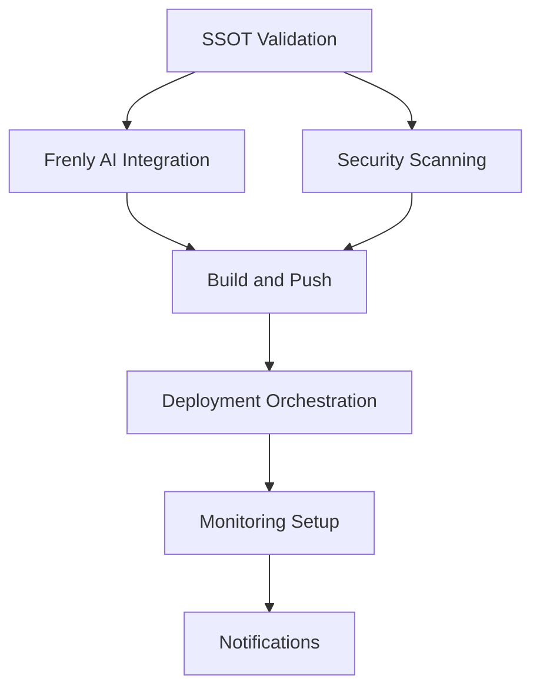

# CI/CD Pipeline Documentation

## Overview

The NEXUS Platform CI/CD pipeline is a comprehensive automation system that ensures code quality, security, and reliable deployment. It integrates with the SSOT (Single Source of Truth) system and Frenly AI automation to provide end-to-end automation.

## Pipeline Architecture

### Workflow Components

1. **SSOT Validation**: Validates SSOT manifest and alias consistency
2. **Frenly AI Integration**: Tests Frenly AI components and protocols
3. **Security Scanning**: Comprehensive security and vulnerability scanning
4. **Build and Push**: Container image building and registry push
5. **Deployment Orchestration**: Kubernetes deployment management
6. **Monitoring Setup**: Monitoring and observability configuration
7. **Notifications**: Success/failure notifications

### Pipeline Triggers

- **Push Events**: Triggered on pushes to main and develop branches
- **Pull Requests**: Triggered on PRs to main branch
- **Scheduled Runs**: Daily at 2 AM UTC
- **Manual Dispatch**: Manual triggering with environment selection

## Workflow Configuration

### Environment Variables

```yaml
env:
  NEXUS_ENV: ${{ github.ref == 'refs/heads/main' && 'production' || 'staging' }}
  REGISTRY: ghcr.io
  IMAGE_NAME: ${{ github.repository }}
```

### Job Dependencies



## Job Details

### 1. SSOT Validation

**Purpose**: Validate SSOT manifest and ensure alias consistency

**Steps**:

- Checkout code
- Setup Python environment
- Install dependencies
- Validate SSOT manifest
- Verify lockfiles
- Check alias consistency
- Validate API contracts

**Outputs**:

- `validation-result`: Success/failure status

**Failure Conditions**:

- Invalid SSOT manifest
- Inconsistent aliases
- Missing lockfiles
- API contract violations

### 2. Frenly AI Integration

**Purpose**: Test Frenly AI components and validate operator protocols

**Steps**:

- Checkout code
- Setup Python environment
- Install Frenly AI dependencies
- Run comprehensive tests
- Upload coverage reports
- Test SSOT operator
- Test SSOT integration
- Validate operator protocols

**Dependencies**: SSOT Validation

**Test Coverage**:

- Unit tests for all components
- Integration tests for SSOT operations
- Protocol validation tests
- Performance tests

### 3. Security Scanning

**Purpose**: Comprehensive security and vulnerability scanning

**Steps**:

- Checkout code
- Setup Python environment
- Install security tools
- Run Bandit security scan
- Run Safety dependency scan
- Run Semgrep security scan
- Upload security reports

**Tools Used**:

- **Bandit**: Python security linter
- **Safety**: Dependency vulnerability scanner
- **Semgrep**: Static analysis security scanner

**Reports Generated**:

- `bandit-report.json`: Security issues
- `safety-report.json`: Dependency vulnerabilities
- `semgrep-report.json`: Static analysis results

### 4. Build and Push

**Purpose**: Build and push container images to registry

**Strategy**: Matrix build for multiple components

- `operator`: Frenly AI SSOT Operator
- `integration`: SSOT Integration Layer
- `monitoring`: Monitoring System
- `security`: Security & Compliance System

**Steps**:

- Checkout code
- Setup Docker Buildx
- Login to container registry
- Extract metadata
- Build and push Docker images

**Features**:

- Multi-platform builds (linux/amd64, linux/arm64)
- Build caching for performance
- Automatic tagging based on branch/PR
- Registry authentication

### 5. Deployment Orchestration

**Purpose**: Deploy applications to Kubernetes

**Steps**:

- Checkout code
- Setup kubectl
- Configure kubectl
- Deploy Frenly AI to Kubernetes
- Verify deployment
- Run health checks

**Deployment Features**:

- Rolling updates
- Health check validation
- Rollback capabilities
- Resource verification

**Health Checks**:

- Pod readiness
- Service availability
- Ingress configuration
- Resource limits

### 6. Monitoring Setup

**Purpose**: Configure monitoring and observability

**Steps**:

- Checkout code
- Setup kubectl
- Configure kubectl
- Setup Prometheus
- Setup SSOT metrics
- Verify monitoring

**Monitoring Components**:

- Prometheus for metrics collection
- Grafana for visualization
- SSOT-specific metrics
- Alert rules configuration

### 7. Notifications

**Purpose**: Send success/failure notifications

**Triggers**:

- Always runs (success or failure)
- Conditional messaging based on results

**Notification Types**:

- Success notifications with deployment details
- Failure notifications with error information
- Environment-specific messaging

## Security Features

### Secret Management

- **GitHub Secrets**: Secure storage of sensitive data
- **Kubernetes Secrets**: Runtime secret management
- **Encrypted Storage**: All secrets encrypted at rest
- **Access Control**: Role-based secret access

### Security Scanning

- **Static Analysis**: Code-level security scanning
- **Dependency Scanning**: Third-party vulnerability detection
- **Container Scanning**: Image security analysis
- **Compliance Checking**: Regulatory compliance validation

### Access Control

- **Branch Protection**: Required reviews and status checks
- **Environment Protection**: Production deployment restrictions
- **Role-Based Access**: Team-based permission management
- **Audit Logging**: Complete action audit trail

## Performance Optimization

### Build Optimization

- **Parallel Jobs**: Concurrent job execution
- **Build Caching**: Docker layer caching
- **Dependency Caching**: Python package caching
- **Matrix Builds**: Parallel component building

### Deployment Optimization

- **Rolling Updates**: Zero-downtime deployments
- **Health Checks**: Fast failure detection
- **Resource Limits**: Efficient resource utilization
- **Auto-scaling**: Dynamic scaling based on load

### Monitoring Optimization

- **Metrics Collection**: Efficient metric gathering
- **Alert Optimization**: Smart alerting rules
- **Dashboard Performance**: Fast dashboard loading
- **Log Aggregation**: Centralized log management

## Troubleshooting

### Common Issues

1. **SSOT Validation Failures**
   - Check SSOT manifest syntax
   - Verify alias consistency
   - Review lockfile integrity

2. **Test Failures**
   - Review test logs
   - Check dependency versions
   - Verify test environment

3. **Security Scan Failures**
   - Address security issues
   - Update vulnerable dependencies
   - Review code for vulnerabilities

4. **Build Failures**
   - Check Dockerfile syntax
   - Verify base image availability
   - Review build context

5. **Deployment Failures**
   - Check Kubernetes cluster status
   - Verify resource availability
   - Review deployment manifests

### Debug Commands

```bash
# Check pipeline status
gh run list --workflow=ssot_automation.yml

# View job logs
gh run view <run-id> --log

# Check deployment status
kubectl get pods -n frenly-ai
kubectl get services -n frenly-ai
kubectl get ingress -n frenly-ai

# Check monitoring
kubectl get pods -n monitoring
kubectl get services -n monitoring
```

### Log Analysis

- **GitHub Actions Logs**: Available in GitHub UI
- **Kubernetes Logs**: `kubectl logs` commands
- **Application Logs**: Container log aggregation
- **Monitoring Logs**: Prometheus/Grafana logs

## Configuration

### Environment-Specific Settings

#### Staging Environment

- Automatic deployment on develop branch
- Limited resource allocation
- Basic monitoring setup
- Non-production secrets

#### Production Environment

- Manual deployment approval
- Full resource allocation
- Comprehensive monitoring
- Production secrets and certificates

### Customization Options

- **Job Timeouts**: Configurable per job
- **Resource Limits**: Adjustable based on needs
- **Notification Channels**: Multiple notification options
- **Deployment Strategies**: Blue-green, canary, rolling

## Best Practices

### Code Quality

- **Pre-commit Hooks**: Automated code quality checks
- **Code Reviews**: Required for all changes
- **Test Coverage**: Minimum 80% coverage
- **Documentation**: Comprehensive documentation

### Security

- **Regular Updates**: Keep dependencies updated
- **Security Scanning**: Continuous security monitoring
- **Access Control**: Principle of least privilege
- **Audit Logging**: Complete audit trail

### Performance

- **Resource Optimization**: Efficient resource usage
- **Caching Strategies**: Appropriate caching
- **Monitoring**: Proactive monitoring
- **Scaling**: Auto-scaling configuration

### Reliability

- **Health Checks**: Comprehensive health monitoring
- **Rollback Plans**: Quick rollback procedures
- **Disaster Recovery**: Backup and recovery plans
- **Incident Response**: Clear incident procedures

## Monitoring and Alerting

### Key Metrics

- **Pipeline Success Rate**: Overall pipeline health
- **Deployment Frequency**: Deployment velocity
- **Lead Time**: Time from commit to production
- **Mean Time to Recovery**: Incident recovery time

### Alert Rules

- **Pipeline Failures**: Immediate notification
- **Security Issues**: High-priority alerts
- **Deployment Issues**: Production impact alerts
- **Performance Degradation**: Resource usage alerts

### Dashboards

- **Pipeline Overview**: High-level pipeline status
- **Deployment History**: Deployment tracking
- **Security Dashboard**: Security metrics
- **Performance Dashboard**: System performance

## Maintenance

### Regular Tasks

- **Dependency Updates**: Monthly dependency updates
- **Security Patches**: Immediate security patches
- **Performance Reviews**: Quarterly performance reviews
- **Documentation Updates**: Continuous documentation updates

### Monitoring Tasks

- **Log Rotation**: Regular log cleanup
- **Metrics Retention**: Appropriate retention periods
- **Alert Tuning**: Regular alert rule optimization
- **Dashboard Updates**: Dashboard maintenance

## Support

### Getting Help

- **Documentation**: Comprehensive documentation
- **Issue Tracking**: GitHub issues
- **Team Support**: Development team contact
- **Community**: Open source community

### Escalation Procedures

1. **Level 1**: Check documentation and logs
2. **Level 2**: Contact development team
3. **Level 3**: Escalate to platform team
4. **Level 4**: Emergency procedures

### Contact Information

- **Development Team**: dev-team@nexus-platform.com
- **Platform Team**: platform-team@nexus-platform.com
- **Security Team**: security-team@nexus-platform.com
- **Emergency**: emergency@nexus-platform.com
